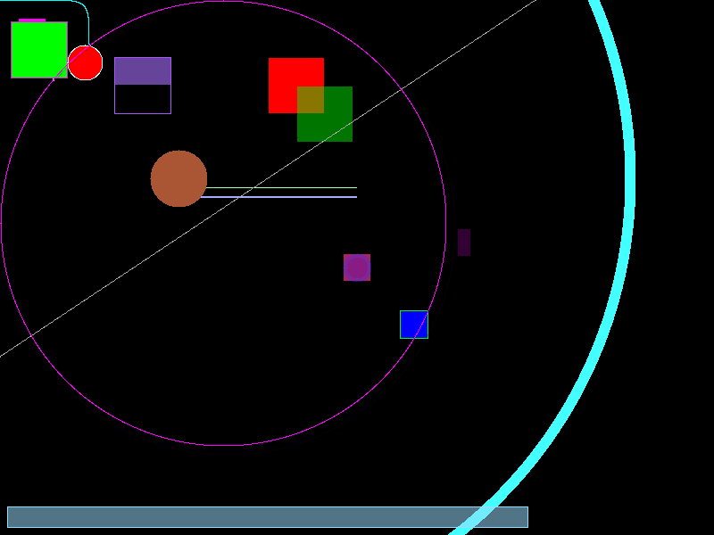

# Raw Rendering with Rust, Winit and Softbuffer

This project was created for me to learn how rendering pixels on-screen works, how it can be done 'universally', and how
stuff like drawing lines, circles, curves, etc. works.

## (Kinda Simplified) Preview diagram

## Project aim

While this project primarily focuses on teaching ME (and anyone who wants to take a look) how rendering works, I also
hope to create a very performant/resource-efficient 2D (and maybe 3D in the future) rendering engine which utilizes only
CPU rendering. I want this project to be platform-agnostic, that means I want to be able to compile it for any platform
with no or minimal tampering with the code.

## Example

This example showcases the program's current abilities on the current commit.

That includes:
- Vector paths that use both straight lines and cubic Bézier curves
- Circles (w/ outlines)
- Rectangles (w/ outlines)
- Absolute and relative positioning and anchor usage

## What's planned
I'll check these things as they get done :3

- [ ] Memory optimization (currently needs 21.4 MiB at 1440p, screen buffer should take 10.54 MiB, objects take only 0.1 MiB, the rest is probably taken by winit and softbuffer)
- [ ] Text rendering
  - [ ] Own font format, won't be implementing standard formats
    - [ ] Pixel-based fonts
    - [ ] Vector-based fonts
  - [ ] Needs proper scaling
- [ ] Rectangles with rounded corners
  - [ ] Rect outlines
  - [ ] Rect fills
- [ ] Filled polygons
- [ ] Own svg-like image format
  - [ ] Proper scaling
- [ ] Proper scaling for any rendered object
- [ ] Own markup language, maybe I'll just utilize XML or JSON, I don't wanna make my own parser.
- [ ] Proper object positioning system (adding offsets/anchors universally to any shape/rendered object)
  - [x] Absolute offset
  - [x] Relative offset
  - [x] Absolute anchor point
  - [ ] Relative anchor point
- [ ] Relative units (%, maybe something like vw/vh and parent-relative % if I implement the necessary underlying 
architecture)
- [ ] 3D object rendering (very basic, no gpu acceleration)
- [x] Re-structure modules - everything does one thing
- [ ] Fix color transparent mixing, make it work blend regardless of method used
- [ ] Gradient object fills and outlines
- [ ] Maybe grouping objects together? To control transparency of all of them at once? :3 
